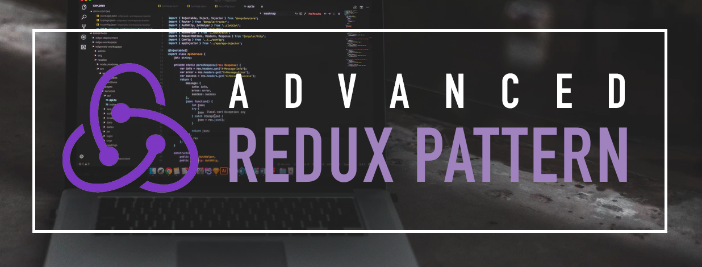

# advanced-redux-pattern

Advanced redux pattern for handling multiple sub dispatch, reusable middleware and scalable redux for large application.

Live Demo the [https://codesandbox.io/s/github/nenjotsu/advanced-redux-pattern](https://codesandbox.io/s/github/nenjotsu/advanced-redux-pattern)

Inspiration [Advanced Redux Patterns - Nir Kaufman @ ReactNYC](https://youtu.be/JUuic7mEs-s)

## Features:
- State management using [redux](https://redux.js.org/)
- Reusable Ajax Request as dispatch using [rxjs](https://github.com/ReactiveX/rxjs) & [redux-observables](https://redux-observable.js.org/) for side effects
- Cancellable Request, in `ComponentWillUnmount` or manual cancel request
- Single Source of Data Flow as Middleware for sub dispatch and multiple dispatch
- Action Creators using [redux-actions](https://github.com/redux-utilities/redux-actions)
- UI Library using [ant-design](https://ant.design/)
- Readable Action Types in redux-dev-tools 
- Implement Folder Structure for Containers & Components
- Api Error handling in single pipeline
- Tutorial @medium [article](https://medium.com/@nenjotsu/scalable-redux-advanced-pattern-with-reactjs-c56ea97245f)

## Why do you need a sub dipatch
For instance you will need to maintain the flow of dispatch in separate folder, to adhere the separation of concerns and debugging purposes, the component will remain clean and not cluttered of multiple or series of this.props.getEpicOne(), this.props.getEpicTwo(), here are reasons why:
  - clean and not cluttered dispatch inside a component
  - easy to debug the side effects in multiple requests
  - manageable flow dispatch to handle multiple dispatch and ajax request
  - dispatch a regular actions alongside with the actions with side effects
  - debuggable flow where/when you start the spinner (loading) and where to stop it
  - reusable dispatch for ajax request, ui, or master data
  - scalable redux and open for extension once you want to use other middleware like `redux-saga`, co-existing or even while you are implementing a new technology for a specific module/usecase.

## TODOs
- Implement [reselect](https://github.com/reduxjs/reselect) for memoizing redux state

## For more question follow me
- twitter [@nenjotsu](https://twitter.com/nenjotsu)
- github [@nenjotsu](https://github.com/nenjotsu)
- medium [@nenjotsu](https://medium.com/@nenjotsu)
